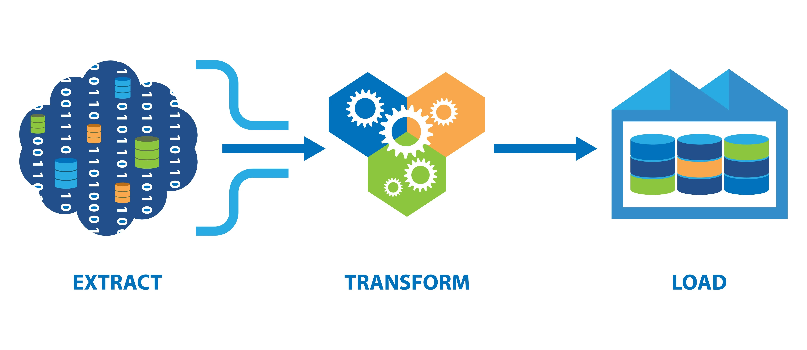
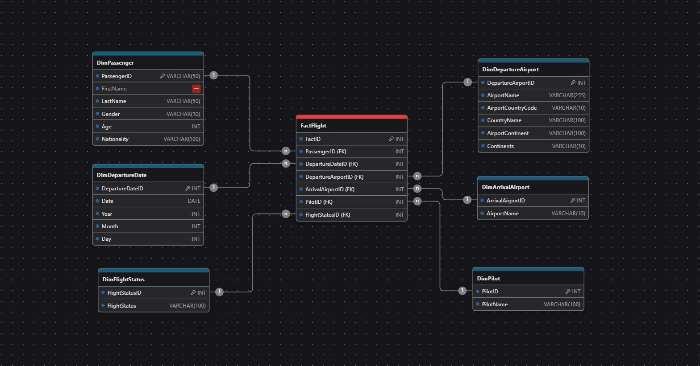

# Proceso ETL

<div style="text-align: center;">
  
</div>

## Extracción

* Obtener los datos de las fuentes originales. El objetivo es obtener los datos de manera eficiente sin  afectar el rendimiento de los sistemas operacionales. Los  datos pueden ser extraídos de  bases de datos relacionales, aplicaciones, servicios web, entre  otros.

## Transformación

* Los datos se limpian, se convierten a un formato estándar y se enriquecen para  que sean consistentes y útiles en el sistema de destino. Esto incluye operaciones como la `validación de datos`, la `agregación`, la `normalización`, entre otros.

### Aspectos a tomar en cuenta para transformar:

* Filtrado de Datos Innecesarios
* Corrección de Errores y Limpieza de Datos
* Normalización y Estandarización de Datos
* Conversión de Tipos de Datos
* Enriquecimiento de Datos
* Agregación de Datos
* Creación de Cálculos Derivados
* Transformación de Formatos
* Validación de Datos Transformados
* Preparación para la Carga

## Carga

* Implica insertar los datos transformados en la base de datos destino o en el almacén de datos. Dependiendo de la naturaleza del proceso, puede ser una carga `completa` (todos los datos se cargan de nuevo) o `incremental` (solo los nuevos o modificados).

## Ejemplo ETL

Para estos ejemplos utilizaremos `Pandas` derivado al uso de `Python` como lenguaje, además se utilizara `SQL Server` como almacenamiento de nuestro `Datawharehouse`, con esto en cuenta debemos tomar en cuenta la instalación de dichas librerías con los siguientes comandos:

```sh
pip install pandas pyodbc tqdm
```

Si deseas instalarlas individualmente, usa:

```sh
pip install pandas
pip install pyodbc
pip install tqdm
```

### Descripción de cada librería y alternativas

1. **pandas**
   - **Uso:** Manejo y análisis de datos estructurados en formato de tablas (DataFrames y Series). Se usa en ciencia de datos, análisis financiero y procesamiento de datos.
   - **Alternativas:**
     - **Polars:** Más rápido y eficiente en memoria que pandas, especialmente para grandes volúmenes de datos.
     - **Dask:** Permite procesar grandes conjuntos de datos de manera distribuida y en paralelo.
     - **Vaex:** Especialmente diseñado para manejar grandes volúmenes de datos sin cargar todo en memoria.

2. **pyodbc**
   - **Uso:** Conectar Python con bases de datos que soportan ODBC, como SQL Server, MySQL y PostgreSQL. Se usa en desarrollo de aplicaciones y análisis de datos.
   - **Alternativas:**
     - **SQLAlchemy:** Proporciona una capa de abstracción para trabajar con bases de datos relacionales.
     - **psycopg2:** Especializado en conexiones con PostgreSQL, ofreciendo un mejor rendimiento.
     - **mysql-connector-python:** Cliente nativo de MySQL para una integración más fluida con esta base de datos.

3. **tqdm**
   - **Uso:** Mostrar barras de progreso en loops y procesos iterativos, útil en procesamiento de datos y machine learning.
   - **Alternativas:**
     - **alive-progress:** Más personalizable y con efectos visuales avanzados.
     - **progressbar2:** Ofrece múltiples estilos de barra y soporte para diferentes entornos.
     - **rich:** Además de barras de progreso, permite imprimir texto con colores y formatos enriquecidos en la terminal.

## Variaciones y consideraciones

Primero se debe elegir que modelo se va a implementar para almacenar los datos extraídos del `.csv`

### Encabezados del Archivo Original
```plaintext
Passenger ID, First Name, Last Name, Gender, Age, Nationality, Airport Name, Airport Country Code, Country Name, Airport Continent, Continents, Departure Date, Arrival Airport, Pilot Name, Flight Status
```

### Modelo Estrella

- **Tabla Hechos - FactFlight**
  - FactID (Clave primaria)
  - PassengerID (Clave foránea a DimPassenger)
  - DepartureDateID (Clave foránea a DimDepartureDate)
  - DepartureAirportID (Clave foránea a DimDepartureAirport)
  - ArrivalAirportID (Clave foránea a DimArrivalAirport)
  - PilotID (Clave foránea a DimPilot)
  - FlightStatusID (Clave foránea a DimFlightStatus)

- **Dimensión Pasajero - DimPassenger**
  - PassengerID (Clave primaria)
  - FirstName
  - LastName
  - Gender
  - Age
  - Nationality

- **Dimensión Fecha - DimDepartureDate**
  - DepartureDateID (Clave primaria)
  - Date
  - Year
  - Month
  - Day

- **Dimensión Aeropuerto de Salida - DimDepartureAirport**
  - DepartureAirportID (Clave primaria)
  - AirportName
  - AirportCountryCode
  - CountryName
  - AirportContinent
  - Continents

- **Dimensión Aeropuerto de Llegada - DimArrivalAirport**
  - ArrivalAirportID (Clave primaria)
  - AirportName

- **Dimensión Piloto - DimPilot**
  - PilotID (Clave primaria)
  - PilotName

- **Dimensión Estado del Vuelo - DimFlightStatus**
  - FlightStatusID (Clave primaria)
  - FlightStatus

<div style="text-align: center;">
  
</div>


Una vez determinado que modelo utilizar se procede a crear dicho modelo pero en nuestro `Datawarehouse`; en este caso en `SQL Server`:

```SQL
CREATE TABLE DimPassenger (
    PassengerID NVARCHAR(50) PRIMARY KEY,
    FirstName NVARCHAR(50),
    LastName NVARCHAR(50),
    Gender NVARCHAR(10),
    Age INT,
    Nationality NVARCHAR(100)
);

CREATE TABLE DimDepartureAirport (
    DepartureAirportID INT PRIMARY KEY,
    AirportName NVARCHAR(200),
    AirportCountryCode NVARCHAR(10),
    CountryName NVARCHAR(100),
    AirportContinent NVARCHAR(10),
	Continents NVARCHAR(100)
);

CREATE TABLE DimArrivalAirport (
    ArrivalAirportID INT PRIMARY KEY,
    AirportName NVARCHAR(10)
);

CREATE TABLE DimDepartureDate (
    DepartureDateID INT PRIMARY KEY,
    Date DATE,
    Year INT,
    Month INT,
    Day INT
);

CREATE TABLE DimPilot (
    PilotID INT PRIMARY KEY,
    PilotName NVARCHAR(100)
);

CREATE TABLE DimFlightStatus (
    FlightStatusID INT PRIMARY KEY,
    FlightStatus NVARCHAR(100)
);

CREATE TABLE FactFlight (
    FactID INT PRIMARY KEY IDENTITY(1,1),
    PassengerID NVARCHAR(50) FOREIGN KEY REFERENCES DimPassenger(PassengerID),
    DepartureDateID INT FOREIGN KEY REFERENCES DimDepartureDate(DepartureDateID),
    DepartureAirportID INT FOREIGN KEY REFERENCES DimDepartureAirport(DepartureAirportID),
    ArrivalAirportID INT FOREIGN KEY REFERENCES DimArrivalAirport(ArrivalAirportID),
    PilotID INT FOREIGN KEY REFERENCES DimPilot(PilotID),
    FlightStatusID INT FOREIGN KEY REFERENCES DimFlightStatus(FlightStatusID)
);
```

Con esto realizado procedemos a realizar nuestro proceso `ETL`:

* [ETL Pandas](./model/star/star.png)
