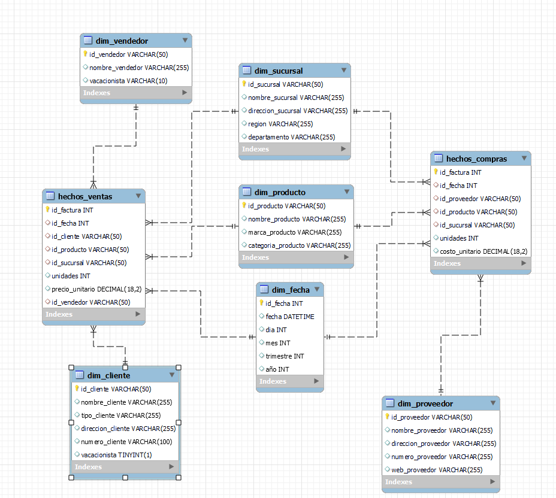

# Manual de implementacion
# Sistema de Business Intelligence para SG-Food

**Sebastian Alejandro Velasquez Bonilla**
**202006635**

## Ventajas del Modelo de Constelación

1. **Reutilización de Dimensiones**:
   - Las dimensiones compartidas, como `Dim_Fecha` y `Dim_Producto`, evitan redundancias y simplifican el mantenimiento. Esto significa que no es necesario duplicar información en cada tabla de hechos, lo que reduce el espacio de almacenamiento y facilita la actualización de datos. Por ejemplo, si se actualiza un producto en la dimensión `Dim_Producto`, este cambio se reflejará automáticamente en todas las tablas de hechos que lo utilicen.
   - Además, la reutilización de dimensiones permite que las consultas sean más consistentes, ya que todas las tablas de hechos comparten las mismas definiciones de dimensiones.

2. **Consultas Cruzadas**:
   - Este modelo facilita la realización de análisis entre diferentes procesos de negocio. Por ejemplo, puedes comparar las ventas y las compras de un producto en un mismo período de tiempo o analizar cómo las ventas en una sucursal específica afectan las compras de inventario.
   - Las dimensiones compartidas, como `Dim_Fecha`, permiten realizar análisis temporales detallados, como identificar tendencias de ventas y compras en diferentes trimestres o años. Esto es especialmente útil para la toma de decisiones estratégicas basadas en datos históricos.

3. **Escalabilidad**:
   - El modelo de constelación es altamente escalable, lo que significa que puedes agregar nuevas tablas de hechos o dimensiones sin necesidad de rediseñar la estructura existente. Por ejemplo, si en el futuro necesitas agregar una tabla de hechos para registrar devoluciones, puedes hacerlo fácilmente reutilizando las dimensiones existentes.
   - Esta escalabilidad lo hace ideal para proyectos en crecimiento, donde las necesidades de análisis pueden evolucionar con el tiempo.

4. **Eficiencia en Consultas**:
   - Los índices creados en las tablas de hechos optimizan las consultas, especialmente cuando se trabaja con grandes volúmenes de datos. Esto mejora significativamente el rendimiento del sistema, permitiendo que las consultas complejas se ejecuten en menos tiempo.
   - Además, al separar los datos en tablas de hechos y dimensiones, las consultas pueden enfocarse en los datos relevantes, reduciendo la cantidad de información procesada y mejorando la velocidad de respuesta.

5. **Flexibilidad Analítica**:
   - Este modelo permite realizar análisis desde diferentes perspectivas, como por cliente, producto, sucursal o período de tiempo. Por ejemplo, puedes analizar las ventas de un producto específico en todas las sucursales o comparar el desempeño de diferentes vendedores en un trimestre.
   - La flexibilidad analítica también permite realizar análisis ad hoc, donde los usuarios pueden explorar los datos desde diferentes ángulos sin necesidad de modificar la estructura del modelo.

6. **Reducción de Redundancia**:
   - Al compartir dimensiones entre múltiples tablas de hechos, se evita la duplicación de datos. Esto no solo ahorra espacio de almacenamiento, sino que también reduce el riesgo de inconsistencias en los datos, ya que las dimensiones se mantienen centralizadas y actualizadas.

7. **Soporte para Análisis Complejo**:
   - El modelo de constelación es ideal para escenarios donde se requiere analizar múltiples procesos de negocio de manera integrada. Por ejemplo, puedes analizar cómo las compras de inventario afectan las ventas en diferentes regiones o cómo las promociones de un producto impactan las ventas y las devoluciones.

### Conclusión

El modelo de constelación es una solución robusta y eficiente para el diseño de un data warehouse. Su capacidad para reutilizar dimensiones, realizar consultas cruzadas y escalar fácilmente lo convierte en una opción ideal para proyectos que requieren análisis complejos y flexibles. Además, su eficiencia en consultas y reducción de redundancia garantiza un rendimiento óptimo incluso con grandes volúmenes de datos. Este diseño es especialmente útil en organizaciones que necesitan integrar múltiples procesos de negocio en un único sistema de análisis, facilitando la toma de decisiones basada en datos.

## Limpieza de Datos en SSIS

El proceso de limpieza de datos es fundamental para garantizar la calidad y consistencia de la información antes de cargarla en el data warehouse. A continuación, se describe cómo se utilizó SSIS para realizar la limpieza de datos, basado en el flujo mostrado en la imagen.

### Componentes Utilizados

1. **Derived Column**:
   - **Propósito**: Crear o modificar columnas en el flujo de datos.
   - **Uso**: Se utilizó para generar nuevas columnas derivadas de las existentes o para aplicar transformaciones como concatenar valores, convertir formatos de fecha o aplicar expresiones condicionales.

2. **Data Conversion**:
   - **Propósito**: Convertir los tipos de datos de las columnas para que coincidan con los requisitos del destino.
   - **Uso**: Garantizó que los datos estuvieran en el formato correcto antes de ser procesados por otros componentes o cargados en el destino.

3. **Union All**:
   - **Propósito**: Combinar múltiples flujos de datos en uno solo.
   - **Uso**: Se utilizó para unificar datos provenientes de diferentes fuentes o transformaciones en un único flujo.

4. **Multicast**:
   - **Propósito**: Duplicar el flujo de datos en múltiples salidas.
   - **Uso**: Permitió que los mismos datos fueran procesados de diferentes maneras en paralelo, como realizar agregaciones en una rama y validaciones en otra.

5. **Aggregate**:
   - **Propósito**: Realizar operaciones de agregación como sumas, promedios o conteos.
   - **Uso**: Resumió los datos antes de cargarlos en el destino, como calcular totales de ventas o compras por fecha, sucursal o producto.

6. **Conditional Split**:
   - **Propósito**: Dividir el flujo de datos en múltiples salidas basándose en condiciones definidas.
   - **Uso**: Filtró filas con valores nulos, datos duplicados o registros que no cumplían con ciertas reglas de negocio.

7. **Lookup**:
   - **Propósito**: Realizar búsquedas en una tabla o conjunto de datos para enriquecer el flujo de datos con información adicional o validar registros.
   - **Uso**: Verificó si los datos ya existían en el destino y agregó claves foráneas o valores relacionados desde una tabla de referencia.

8. **Sort**:
   - **Propósito**: Ordenar los datos en el flujo según una o más columnas y eliminar duplicados si es necesario.
   - **Uso**: Garantizó que los datos estuvieran ordenados y sin duplicados antes de ser cargados.

9. **OLE DB Destination**:
   - **Propósito**: Cargar los datos procesados en una base de datos SQL Server.
   - **Uso**: Fue el destino final del flujo de datos, donde se almacenaron los datos limpios y transformados.

### Flujo General del Proceso

1. **Preparación de los Datos**:
   - Los datos pasaron primero por componentes como `Derived Column` y `Data Conversion` para asegurarse de que estaban en el formato correcto.

2. **Transformaciones y Validaciones**:
   - Se aplicaron transformaciones como agregaciones (`Aggregate`), divisiones condicionales (`Conditional Split`) y búsquedas (`Lookup`) para enriquecer y validar los datos.

3. **Unificación y Limpieza**:
   - Los datos de diferentes fuentes o ramas se combinaron utilizando `Union All` y se ordenaron o filtraron con `Sort` para garantizar su calidad.

4. **Carga en el Destino**:
   - Finalmente, los datos limpios y transformados se cargaron en el destino (`OLE DB Destination`), listos para ser utilizados en análisis y reportes.

### Conclusión

El flujo de datos en SSIS demuestra un enfoque estructurado para la limpieza y transformación de datos. Cada componente tiene un propósito claro y contribuye a garantizar que los datos cargados en el data warehouse sean consistentes, precisos y útiles para el análisis. La combinación de herramientas como `Conditional Split`, `Lookup` y `Aggregate` permite manejar datos complejos y garantizar su calidad antes de la carga final.

## Descripción de las fases del proceso ETL

El proceso ETL (Extract, Transform, Load) es fundamental para la integración y preparación de datos en un sistema de Business Intelligence. A continuación, se describen las fases principales:

1. **Extracción (Extract)**:
   - **Propósito**: Obtener datos de diversas fuentes, como bases de datos relacionales, archivos planos, APIs o sistemas externos.
   - **Detalles**: En esta fase, los datos se extraen en su formato original, asegurando que toda la información relevante sea capturada. Por ejemplo, se pueden extraer datos de ventas desde un sistema ERP y datos de inventario desde un sistema de gestión de almacenes.

2. **Transformación (Transform)**:
   - **Propósito**: Limpiar, enriquecer y transformar los datos para que sean consistentes y útiles para el análisis.
   - **Detalles**: Incluye tareas como:
     - Eliminación de duplicados y valores nulos.
     - Conversión de formatos de fecha y tipos de datos.
     - Aplicación de reglas de negocio, como calcular márgenes de ganancia o clasificar productos por categorías.
     - Enriquecimiento de datos mediante búsquedas (`Lookup`) o uniones con otras fuentes.

3. **Carga (Load)**:
   - **Propósito**: Almacenar los datos transformados en el destino final, como un data warehouse o un data mart.
   - **Detalles**: En esta fase, los datos se cargan en estructuras optimizadas para consultas y análisis. Esto puede incluir la creación de índices, particiones o agregaciones para mejorar el rendimiento.

### Importancia del Proceso ETL

El proceso ETL garantiza que los datos utilizados en el sistema de Business Intelligence sean precisos, consistentes y relevantes. Una implementación adecuada de ETL permite:
- Reducir errores y redundancias en los datos.
- Mejorar la calidad de los análisis y reportes.
- Facilitar la integración de múltiples fuentes de datos en un único repositorio centralizado.

### Conclusión

El proceso ETL es un componente esencial en cualquier proyecto de Business Intelligence. Su correcta implementación asegura que los datos sean confiables y estén listos para soportar la toma de decisiones estratégicas en la organización.

## Requisitos para la Implementación

Para implementar el sistema de Business Intelligence para SG-Food, es necesario cumplir con los siguientes requisitos:

### Requisitos de Hardware
1. **Servidor de Base de Datos**:
   - Procesador: Mínimo 4 núcleos (recomendado 8 núcleos).
   - Memoria RAM: Mínimo 16 GB (recomendado 32 GB o más).
   - Almacenamiento: SSD con al menos 500 GB de espacio disponible.
   - Conectividad: Red de alta velocidad (Gigabit Ethernet).

2. **Estaciones de Trabajo**:
   - Procesador: Mínimo 2 núcleos.
   - Memoria RAM: Mínimo 8 GB.
   - Almacenamiento: HDD o SSD con al menos 100 GB de espacio disponible.
   - Resolución de pantalla: 1920x1080 o superior.

### Requisitos de Software
1. **Sistema Operativo**:
   - Windows Server 2019 o superior para el servidor.
   - Windows 10 o superior para estaciones de trabajo.

2. **Herramientas de Desarrollo y Análisis**:
   - SQL Server con Integration Services (SSIS), Analysis Services (SSAS) y Reporting Services (SSRS).
   - Visual Studio con extensiones para BI.
   - Microsoft Excel (opcional, para análisis adicional).

3. **Otros**:
   - Controlador OLE DB para conectividad con bases de datos.
   - Herramientas de monitoreo como SQL Server Management Studio (SSMS).

### Requisitos de Conocimiento
1. **Equipo Técnico**:
   - Conocimiento en diseño de bases de datos relacionales y multidimensionales.
   - Experiencia en el uso de SSIS, SSAS y SSRS.
   - Familiaridad con lenguajes de consulta como SQL.

2. **Usuarios Finales**:
   - Capacitación básica en el uso de herramientas de análisis y reportes.
   - Conocimiento de los procesos de negocio relevantes.

### Requisitos de Datos
1. **Fuentes de Datos**:
   - Acceso a sistemas de origen como ERP, CRM o sistemas de inventario.
   - Archivos planos o bases de datos relacionales con datos históricos.

2. **Calidad de Datos**:
   - Los datos deben estar completos, consistentes y actualizados.
   - Identificación de posibles problemas de calidad, como duplicados o valores nulos.

### Plan de Implementación
1. **Preparación**:
   - Configurar el entorno de hardware y software.
   - Validar la conectividad con las fuentes de datos.

2. **Desarrollo**:
   - Diseñar y construir el modelo de datos (constelación).
   - Configurar y probar los flujos ETL en SSIS.

3. **Pruebas**:
   - Validar la calidad de los datos cargados en el data warehouse.
   - Realizar pruebas de rendimiento y consultas.

4. **Despliegue**:
   - Implementar el sistema en el entorno de producción.
   - Capacitar a los usuarios finales.

5. **Mantenimiento**:
   - Monitorear el rendimiento del sistema.
   - Actualizar y optimizar los flujos ETL según sea necesario.

### Conclusión

Cumplir con estos requisitos asegura una implementación exitosa del sistema de Business Intelligence para SG-Food. La planificación adecuada y la capacitación del equipo son clave para maximizar el valor del sistema y garantizar su sostenibilidad a largo plazo.